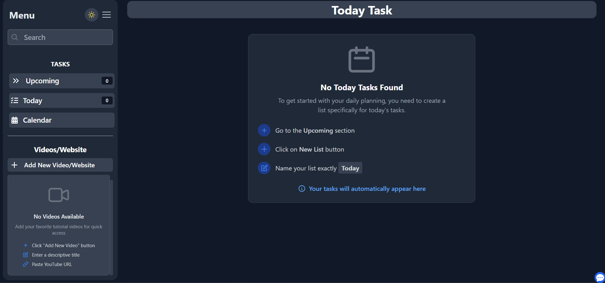

# My Todo App

A modern, feature-rich Study app application built with React and TailwindCSS that helps you organize your tasks, manage your schedule, and stay productive.



## Features

- **Task Management**
  - Create, edit, and delete task lists
  - Add, modify, and remove individual tasks
  - Mark tasks as complete
  - Organize tasks in customized lists

- **Daily Focus**
  - Special "Today" view for focusing on current tasks
  - Quick task addition and management

- **Calendar Integration**
  - View and manage events on an interactive calendar
  - Add new events with custom titles
  - Visual representation of your schedule

- **Web Content Integration**
  - Embed YouTube videos and web content
  - Quick access to learning resources and references

- **User Experience**
  - Responsive design for all devices
  - Dark/Light mode toggle
  - Collapsible sidebar for maximum workspace
  - Persistent storage using localStorage

## Tech Stack

- **Frontend Framework**: React.js
- **Routing**: React Router v7
- **Styling**: TailwindCSS
- **Calendar**: React Big Calendar with Moment.js
- **Icons**: React Icons
- **UUID Generation**: uuid
- **Build Tool**: Vite

## Installation

1. Clone the repository
   ```bash
   git clone https://github.com/yourusername/todo-app.git
   cd todo-app
   ```

2. Install dependencies
   ```bash
   npm install
   ```

3. Start the development server
   ```bash
   npm run dev
   ```

4. Open your browser and navigate to `http://localhost:5173`

## Usage

### Task Management

- Click "New List" to create a task list
- Add tasks to any list using the "Add New Task" button
- Click on task text to mark it as complete
- Use the edit icon to modify tasks or lists
- Use the delete icon to remove tasks or lists

### Today View

- Create a list named "Today" to manage daily tasks
- Tasks from this list will appear in the Today section

### Calendar

- Click on any time slot to add a new event
- Click on existing events to delete them
- Navigate between months and weeks using the calendar controls

### Web Content

- Add YouTube videos or websites using the "Add New Video/Website" button
- Enter a title and the URL to create a new entry
- Click on any entry to view the embedded content

### Theme Toggle

- Use the sun/moon icon in the sidebar to toggle between light and dark mode

## Development

### Project Structure

```
todo-app/
├── src/
│   ├── components/      # React components
│   ├── App.jsx          # Main application component
│   ├── TodoContext.jsx  # Context for state management
│   ├── App.css          # Global styles
│   ├── index.css        # TailwindCSS imports
│   └── main.jsx         # Application entry point
├── public/              # Static assets
└── ...config files      # Configuration files
```

### Building for Production

```bash
npm run build
```

Production files will be generated in the `dist/` directory.

## License

[MIT](LICENSE)

## Acknowledgements

- Icons provided by [React Icons](https://react-icons.github.io/react-icons/)
- Calendar functionality by [React Big Calendar](https://github.com/jquense/react-big-calendar)
- Styling powered by [TailwindCSS](https://tailwindcss.com/)
